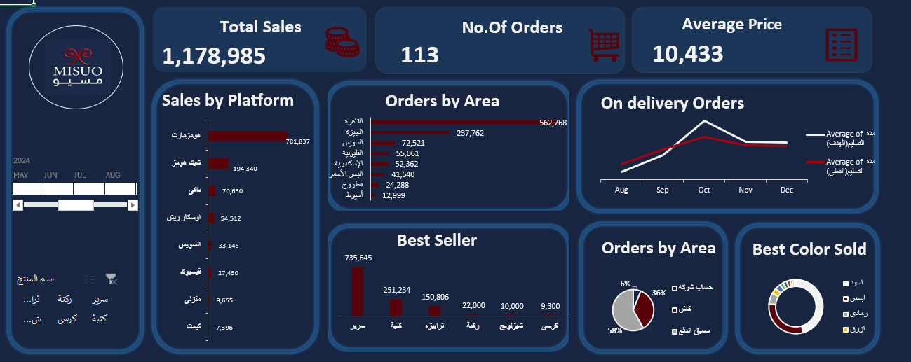

# MISUO-Sales-Dashboard
End-to-end Excel Sales Performance Dashboard featuring Pivot Tables, dynamic slicers, KPI tracking, and channel analysis.

#  MISUO Sales Dashboard - Microsoft Excel

##  Project Overview
This project presents an interactive sales dashboard built in **Microsoft Excel** for **MISUO**. The primary goal is to analyze commercial performance, evaluate sales operations across digital channels and regions, and identify top and bottom-performing products [1, 2].
## 📷 Project Preview

### 🎨 Cover Page

### 📊 Interactive Sales Dashboard

---

##  Key Metrics & Performance Indicators (KPIs)
* **Total Sales:** 1,178,985 [1]
* **Total Orders:** 113 orders [1]
* **Average Selling Price:** 10,433 [1]
* **Best-Selling Products:** Sales breakdown across product categories, led by Beds and Tables, followed by Corner Sofas, Chaise Longues, and Chairs [1].
* **Sales by Channel/Platform:** Revenue distribution across digital channels, including Homzmart, Chic Homes, Taki, Oscar Rattan, Suez, Facebook, Manzeli, and Kemit [1].
* **Geographical Distribution (Orders by Area):** Regional analysis covering Cairo, Giza, Suez, Qalyubia, Alexandria, Red Sea, Matrouh, and Asyut [1].
* **Top Colors Sold:** Sales volume grouped by color preferences (Black, White, Grey, Blue) [1].
* **Payment Methods:** Account Transfer (58%), Cash on Delivery (36%), and Prepaid (6%) [1].
* **Delivery Status Tracking:** Target vs. actual on-time delivery rates tracked across months [1].

---

##  Excel Workbook Structure
The workbook `MISUO_Final.xlsx` is structured into the following worksheets [1-3]:
1. `الارشادات` (Guidelines): Specifies core objectives and required KPIs [2].
2. `البيانات` (Raw Data): Unprocessed sales transaction dataset [1-3].
3. `Cleaned`: Data after cleaning and transformation [1-3].
4. `Pivot Tables`: Data aggregations and summaries [1-3].
5. `Cover`: Executive landing page introducing the report [3].
6. `Board`: Main interactive dashboard featuring dynamic slicers and visual charts [1].

---

## 🛠️ Tools & Techniques
* **Microsoft Excel:** Data Cleaning, Pivot Tables, Pivot Charts, Dynamic Slicers, Visual Analytics.
